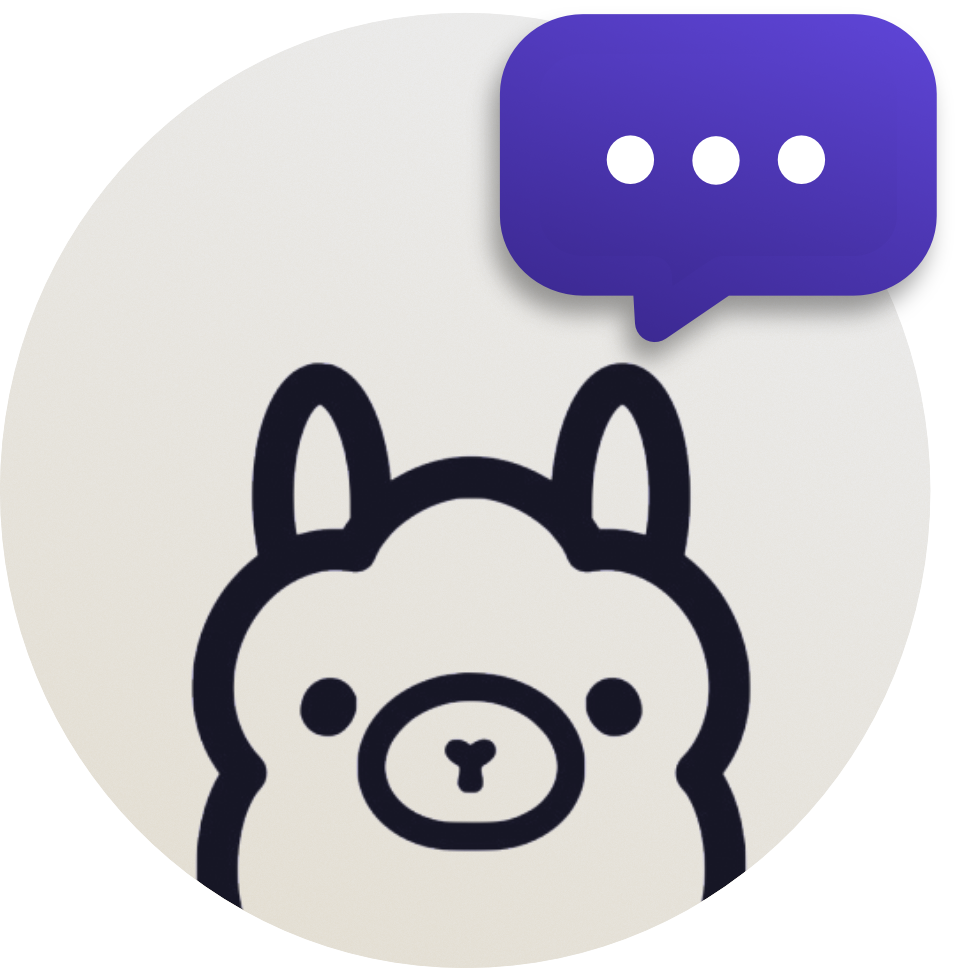

# OCHAT - Ollama Chat
Ochat is a chat Android app client for Ollama AI. Ochat supports chats with different Ollama models

>[!NOTE] 
>You need to deploy Ollama server by your way to use Ochat

## 📱 Requirements
To use this app you need at least Android 8.0 or upper

## 🔨 Building
To build the proyect, clone it using `git clone https://github.com/Asierso/ochat-app` and open it in Android Studio
- Proyect is prepared to compile with SKD 33 (Android 13)

## 🐳 Deploy Ollama in Docker
To deploy Ollama to use with ochat, is better to use Docker containers. You can check the steps [here](https://hub.docker.com/r/ollama/ollama)
